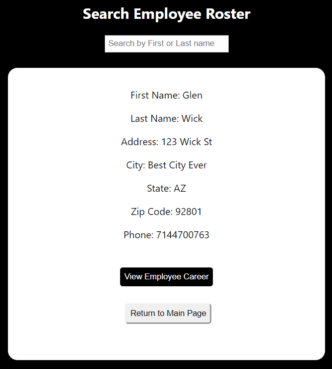

# Mobile employee management App 

[LIVE VERSION](https://management-app-employee-database.now.sh/)

## Login Info 
UserName: Alex

Password: password

A simple employee managment app with a minimalist design.
Used for storing, updating, and deleting an employee roster. 

## Landing Page

Landing Page explaining app functionality

## Main Page

After login, the user is presented with a display of the app functions

## View Employees

The user can view the current employee roster and search for an employee as well with a link to their career

## Create Employees

The user can create a new employee and assign their career and current manager which is the user

## Search and Update

The user can search for an employee by first or last name and proceed to an update field for any info that has changed 

## Search and Delete

The user can Search the current employee roster by first or last name and delete the selected employee

Further components and functionality will be added in the furture..this is just the beginning.

